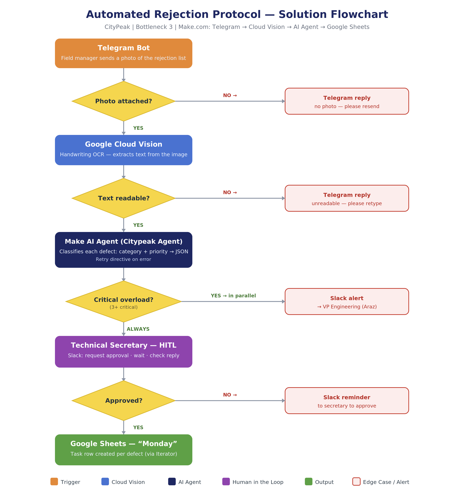

# CityPeak AI Automation — Case Study Site

A single-page case study site for an AI/automation final project: an end-to-end Make.com pipeline that turns a handwritten defect list, photographed on a construction site, into an approved task in a project management tool — no manual data entry.

**Live site:** https://idomokady.github.io/final-project-ai-course/
**Live Make.com scenario:** https://eu1.make.com/public/shared-scenario/3h2F68oBXyq/final-project-v2



## What this project covers

- Mapping an organization's workflow to find its highest-ROI automation opportunity
- Designing a Make.com scenario: Telegram → Google Cloud Vision (handwriting OCR) → AI Agent (classification) → human approval (HITL) → Monday.com + Google Sheets
- Edge-case handling (unreadable photos, no response within SLA, critical-overload alerts)
- KPI definition and projected ROI (93% reduction in late-delivery penalties)

## Stack

Plain HTML/CSS/JS — no build step, no dependencies. Fonts via Google Fonts (Heebo). Deployed as a static site via GitHub Pages.

## Structure

```
index.html          the entire site (markup, styles, and interaction logic)
images/              flowchart and Make.com scenario screenshots
assets/              downloadable PDFs (CV, spec document, field one-pager) + favicon
```

## Author

**Ido Mokady** — UX & Product Designer, AI Automation
[idomokady.com](https://idomokady.com) · [LinkedIn](https://linkedin.com/in/idomokady) · idomokady@gmail.com
